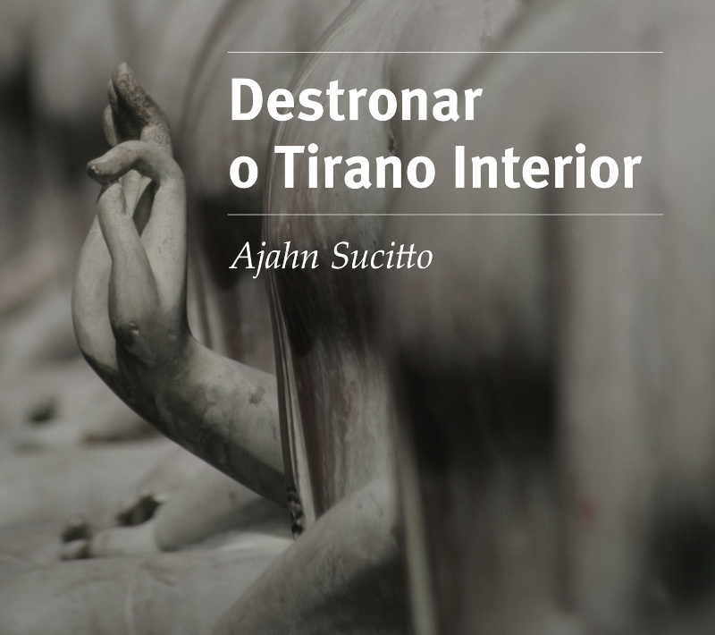

= Destronar o Tirano Interior
:booktitle: {doctitle}
:description: Inveja, Desejo Egoísta e Ensinamentos do Buda sobre Ciclos Viciosos
:author: Ajahn Sucitto
:creator: {author}
:version: v1.0
:revdate: 2022-05-22
:doctype: book
:lang: pt
:pubs-logo: sumedharama-logo-black-w150.jpg
:publisher-name: Publicações Sumedhārāma
:publisher-link-name: www.sumedharama.pt
:publisher-link-url: https://sumedharama.pt
:source: https://forestsangha.org
:keywords: Ajahn Sucitto, Dhamma, Buddhism, RELIGION / Buddhism / Theravada
:copyright: CC-BY-NC-ND 4.0
:isbn: 978-989-8994-34-9
:identifier: isbn:{isbn}
:imagesdir: assets/photos/92dpi-ebook-sRGB
:includes: manuscript/asciidoc
:front-cover-image: 
:toc: left
:toc-title: Índice
:toclevels: 0

include::{includes}/titlepage.adoc[]

include::{includes}/dedication.adoc[]

include::{includes}/destronar.adoc[]

include::{includes}/copyright.adoc[]

